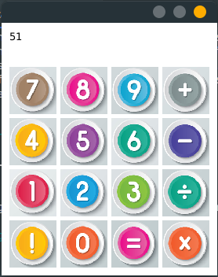

<div dir="auto" align="right">

# ماشین حساب گرافیکی

در این تمرین قرار است قسمت گرافیکی (front-end) یک ماشین حساب را پیاده سازی کنید.

ماشین حسابی که قرار است پیاده سازی کنید به این شکل است که ابتدا عملوند اول سپس عملگر و در آخر عملوند دوم را از کاربر گرفته و نتیجه را به او نمایش می‌دهد.

عملگر هایی که این ماشین حساب توانایی محاسبه آنها را دارد عبارتند از:

<div dir="auto" align="left">

+ Plus (+)
+ Minus (-)
+ Divide (/)
+ Multiply (*)

</div>

اما هیچ لازم نیست شما درگیر پیچیدگی های محاسبه شوید!

به همین دلیل قسمت `logic` برنامه برای شما نوشته شده است. و شما فقط باید قسمت گرافیکی برنامه را پیاده سازی کنید.

در کلاس `Calculator` متد استاتیکی به اسم `calculate` وجود دارد که دو عملوند و عملگر را گرفته و نتیجه محاسبه را برمی‌گرداند.

کار شما این است که از عکس های موجود در دایرکتوری `src/main/resources` موجود است کمک بگیرید و رابط کاربری گرافیکی ماشین حساب را بسازید.

انتظار می‌رود در آخر همچین شکلی تولید کنید:

<div align="center">



</div>


که دکمه `!` اینجا به معنی clear است. یعنی وقتی فشرده شود، عملوندی که هم اکنون در حال نوشتن آن هستیم پاک می‌شود و مجددا می‌توانیم آن عملوند را بنویسیم.

برای پیاده سازی به نکات زیر توجه کنید:

+ ورودی ماشین حساب فقط از طریق کلیک کردن ماوس است.

+ برای ساده سازی می‌توانید طوری پیاده سازی کنید که روند زیر در زمان اجرا طی شود:
    1. عدد اول را وارد می‌کنید.
    2. عملگر را انتخاب می‌کنید.(در این زمان صفحه نمایش ماشین حساب خالی می‌شود یعنی عملوند اول و عملگر ذخیره می‌شوند)
    3. عدد دوم را وارد می‌کنید.
    4. دکمه `=` را انتخاب می‌کنید.(در این زمان عملوند دوم هم دخیره می‌شود پس صفحه نمایش پاک می‌شود و نتیجه را نمایش می‌دهد)
    5. حال می‌توانید با زدن دکمه clear به مرحله یک برگردید. یا اینکه نتیجه عملیات قبل را به عنوان عملوند اول عملیات جدید در نظر بگیرید و به مرحله دو برگردید.

+ نمره دهی رقابتی است و هرچه خلاقیت بیشتری داشته باشید نمره بیشتری می‌گیرید.

## مثال
اگر دکمه های زیر به ترتیب از چپ به راست وارد شوند،‌ باید نتایج زیر را مشاهده کنیم :

<div dir="auto" align="left">

+ `1`,`2`,`+`,`2`,`=` -> `14.0`
+ `1`,`2`,`+`,`2`,`=`,`+`,`1`,`=` -> `15.0`
+ `1`,`2`,`+`,`2`,`=`,`!`,`1`,`*`,`4`,`=` -> `4.0`

</div>

<div dir="auto" align="left">

### Instructions


<ul>
<li>
clone in your computer:

```
git clone your_repo_url
cd your_repo_dir
```
</li>

<li>
run tests from terminal:

```
mvn clean test
```
</li>

<li>
push changes to the repository:

```
git add .
git commit -m "commit message"
git push
```
</li>
</ul>

</div>